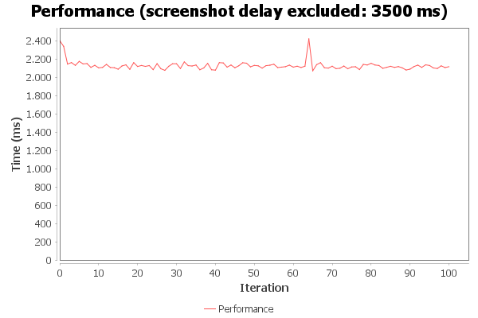
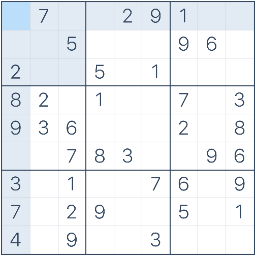

# SudokuSolver

SudokuSolver is a successor from my previous [version](https://github.com/Stonebank/SudukoSolver-Old).
The newer version of the software will use [OpenCV](https://opencv.org/) and [Tesseract](https://en.wikipedia.org/wiki/Tesseract) with the digits trained dataset. 

The older software did not always work as intended. The objective is to make this software work flawlessly at any time. 

# Requirements

This project has been developed with JDK 17. It is recommended to use this version to avoid any obstacles with the software.

# Usage

To run SudokuSolver, clone the project via your IDE or code editor and execute "Launch.java".

To obtain the best results, keep the opened browser in focus.

The SudokuSolver is tested with https://www.sudoku.com for now.

# Software performance

I conducted a performance test of SudokuSolver using www.sudoku.com in evil mode with 100 iterations and an average performance of 2142 milliseconds. It is important to note that the hardware configuration can naturally affect the performance of the solver.

The steps included in this benchmark are:
1. Opening the browser and the website
2. Screenshot of the website
3. Image processing
4. OCR
5. Solving the Sudoku
6. Filling the Sudoku

# Backtracking solving algorithm 

The backtracking solving algorithm is a brute-force search algorithm that tries all the possible combinations of numbers until a solution is found that satisfies the constraints of the puzzle.
Read more about it [here](https://www.geeksforgeeks.org/backtracking-algorithms/)

# OpenCV algorithm 

The objective of this algorithm is to identify and extract a Sudoku board from an image. 

## Board detection 
1. Image is converted to grayscale 
2. Blur filter is applied to the image to reduce noise
3. Canny edge detection algorithm to identify the contours and selects the largest contour
4. It adds a margin to remove any borderlines 
5. Finally, the image is extracted by using the coordinates of the bounding rectangle

### The extra processing technique
In order to prepare for optimal contour detection and cell cropping, the board is preprocessed with the following steps:

1. The output image is converted to grayscale
2. Gaussian blur is applied to the grayscaled image to smooth the image
3. Adaptive threshold to convert the image to black and white

# Digit detection in each cell

To ensure that the digit is in focus for the best OCR results, I had to design a solution that ensured the digit was cropped without any grid or borders included. This was because any non-cropped grid or border was often detected as either a '1' or a '7' which often resulted in incorrect solutions for the sudoku board. My solution was done with the following steps for each cell:

1. Convert the cell image to grayscale
2. Apply thresholding to create a binary image
3. Find contours in the binary image
4. Find the contour with the largest area (assumed to be the contour of the digit in the cell)
5. Find the bounding rectangle of the largest contour
6. Extract the region within the bounding rectangle

# Tesseract 

The objective of this algorithm is to perform OCR to identify the digit. The training dataset applied for this is specified for digit training.

# Developer

This software is developed and designed by Hassan K

